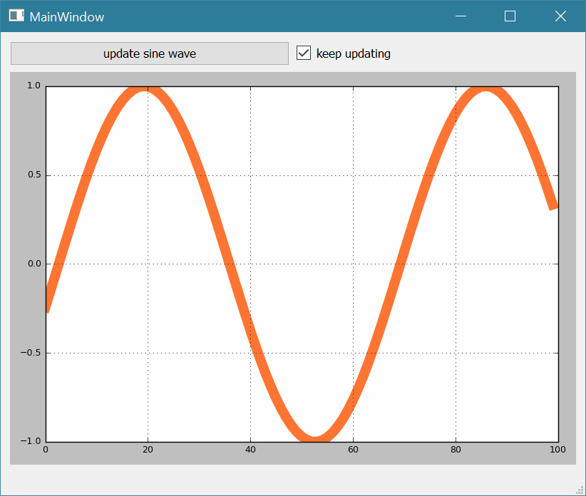

# Matplotlib MatplotlibWidget demo
This was tested to be ~40x SLOWER than a similar pyqtgraph graph

PROJECT PAGE: http://www.swharden.com/wp/2016-07-30-live-data-in-pyqt4-with-matplotlibwidget/

This is a minimal-case example how to get a PyQt4 GUI (designed with QT Designer) to display a matploblit widget and update it automatically. This was tested with the WinPython 3.x distribution, but should be cross platform. Read the parent readme for full project details.

* edit the ui_main.ui with "Qt Designer"
* run ui_convert.py to turn ui_main.ui into ui_main.py
* run go.py to launch the program (pulling UI from ui_main.py)
* if the "keep updating" box is checked and the add buttin is hit, it does more and more!

### Misc notes
If you get `ImportError: No module named 'matplotlibwidget'`, ensure you are in the same folder as `matplotlibwidget.py` which is now provided with this example.