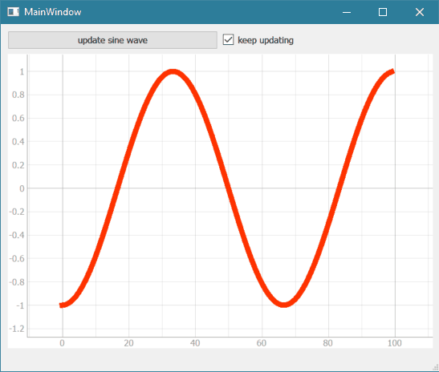

# PyQtGraph GraphWidget demo
This was tested to be ~40x faster than a similar matplotlib graph

This is a minimal-case example how to get a PyQt4 GUI (designed with QT Designer) to display a 
pyqtgraph PlotWidget and update it automatically. This was tested with the WinPython 3.x distribution, 
but should be cross platform. Read the parent readme for full project details.

* edit the ui_main.ui with "Qt Designer"
* run ui_convert.py to turn ui_main.ui into ui_main.py
* run go.py to launch the program (pulling UI from ui_main.py)
* if the "keep updating" box is checked and the add buttin is hit, it does more and more!

