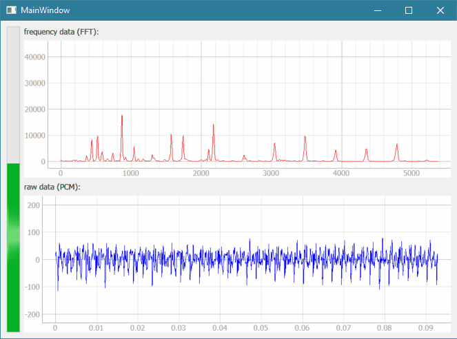

# qt audio monitor

PROJECT PAGE: http://www.swharden.com/wp/2016-07-31-real-time-audio-monitor-with-pyqt/

This is a minimal-case example how to get continuous PCM data from the sound card. A preliminary SWHEar class is included which can self-detect likely input devices. To manually define an input device, set it when SWHEar() is called. In most cases it will work right out of the box. If you're playing music and no microphone is detected, it will use the sound mapper and graph the audio being played.

Youtube demo: https://youtu.be/lDS9rI0o6mM



### Input overflow error?
If you experience _[Errno -9981] Input overflowed_ errors, consider modifying [this line](https://github.com/swharden/Python-GUI-examples/blob/master/2016-07-37_qt_audio_monitor/SWHear.py#L119) and change:
```python
self.stream.read(self.chunk)
```
to:
```python
self.stream.read(self.chunk, exception_on_overflow=False)
```
