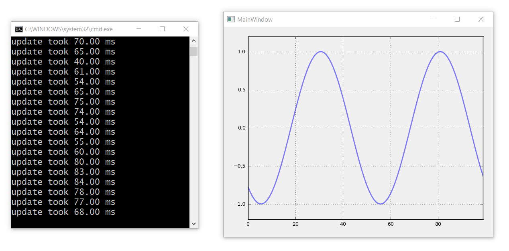

# Live MatplotlibWidget with PyQt4 / Python 2.7
The Python 2.7 PyQt4 toolsets are quite complete. WinPython 2.7 comes with QtDesigner and MatplotlibWidget out of the box. This project is a good starting point for a data visualization project for these platforms.

## Summary
* in UI designer add a MatplotlibWidget and save as `ui_main.ui`
* run ui2py.py to convert `ui_main.ui` -> `ui_main.py`
* create a file like `run.py` and at the top import the ui with `import ui_main`
* write some code to interact with the UI (look at the source code for details)
* key lines for transparent matplotlib window (with transparent background and transparent frame):

```
self.matplotlibwidget.axes.set_axis_bgcolor('none') # make a transparent graph background
self.matplotlibwidget.figure.set_facecolor('none') # make a transparent frame background
```

## Output

