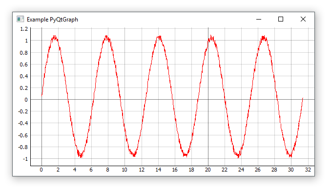

This project demonstrates how to use the standalone `pyqtgraph` library (http://www.pyqtgraph.org/) with Python 3 to launch an interactive plot with a set of X/Y data.

Unlike other projects in this repository, this one doesn't require the user to set up a GUI (like a GTK/Glade-centric projects do). This is a great alternative to [matplotlib](https://matplotlib.org/) when the goal is to rapidly display and manipulate high density data.

## Installation
```
pip install --upgrade pyqtgraph
```

## Example Code

```python
import pyqtgraph as pg
import pyqtgraph.exporters
import numpy as np

# set the styling of pyqtgraph
pg.setConfigOption('background', 'w')
pg.setConfigOption('foreground', 'k')

# create some data
pointCount = 1000
xs = np.arange(pointCount)/pointCount*np.pi*2*5
ys = np.sin(xs)

# add noise
ys += np.random.random_sample(len(ys))/10

# create plot
plt = pg.plot(xs, ys, title="Example PyQtGraph", pen='r')
plt.showGrid(x=True,y=True)

## Start Qt event loop.
if __name__ == '__main__':
    import sys
    if sys.flags.interactive != 1 or not hasattr(pg.QtCore, 'PYQT_VERSION'):
        pg.QtGui.QApplication.exec_()
```

## Screenshot
